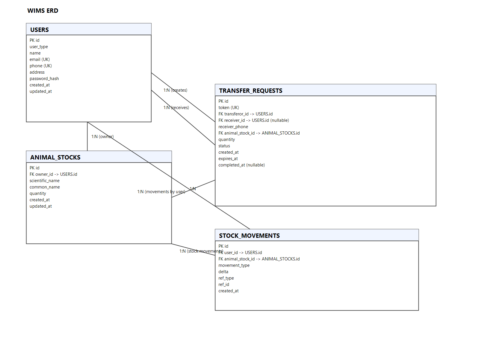
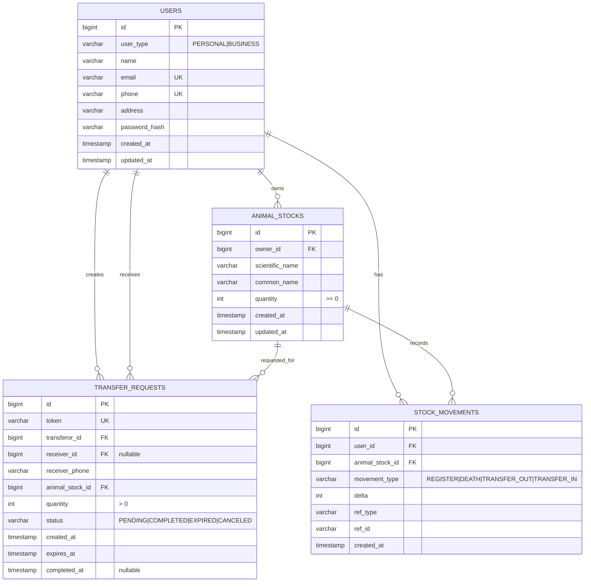

# WIMS ERD

```mermaid
erDiagram
    USERS ||--o{ ANIMAL_STOCKS : owns
    USERS ||--o{ TRANSFER_REQUESTS : creates
    USERS ||--o{ TRANSFER_REQUESTS : receives
    ANIMAL_STOCKS ||--o{ TRANSFER_REQUESTS : requested_for
    USERS ||--o{ STOCK_MOVEMENTS : has
    ANIMAL_STOCKS ||--o{ STOCK_MOVEMENTS : records

    USERS {
        bigint id PK
        varchar user_type "PERSONAL|BUSINESS"
        varchar name
        varchar email UK
        varchar phone UK
        varchar address
        varchar password_hash
        timestamp created_at
        timestamp updated_at
    }

    ANIMAL_STOCKS {
        bigint id PK
        bigint owner_id FK
        varchar scientific_name
        varchar common_name
        int quantity ">= 0"
        timestamp created_at
        timestamp updated_at
    }

    TRANSFER_REQUESTS {
        bigint id PK
        varchar token UK
        bigint transferor_id FK
        bigint receiver_id FK "nullable"
        varchar receiver_phone
        bigint animal_stock_id FK
        int quantity "> 0"
        varchar status "PENDING|COMPLETED|EXPIRED|CANCELED"
        timestamp created_at
        timestamp expires_at
        timestamp completed_at "nullable"
    }

    STOCK_MOVEMENTS {
        bigint id PK
        bigint user_id FK
        bigint animal_stock_id FK
        varchar movement_type "REGISTER|DEATH|TRANSFER_OUT|TRANSFER_IN"
        int delta
        varchar ref_type
        varchar ref_id
        timestamp created_at
    }
```
